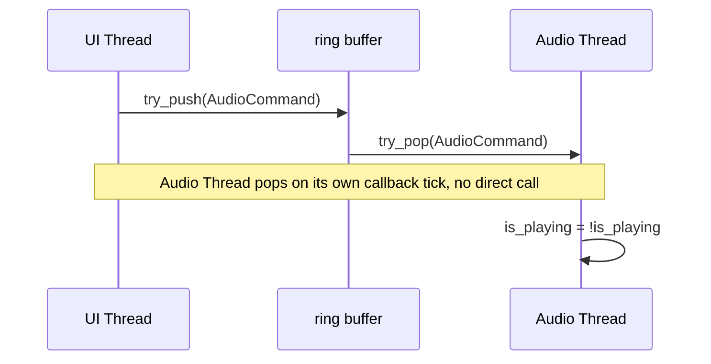

# glacier-app

The Glacier app module contains all of the code for setting up and running the audio and graphics thread.

The architecture involve two decoupled threads communicating events to ring buffers. The app logic is combined on a native desktop application via `winit`.

