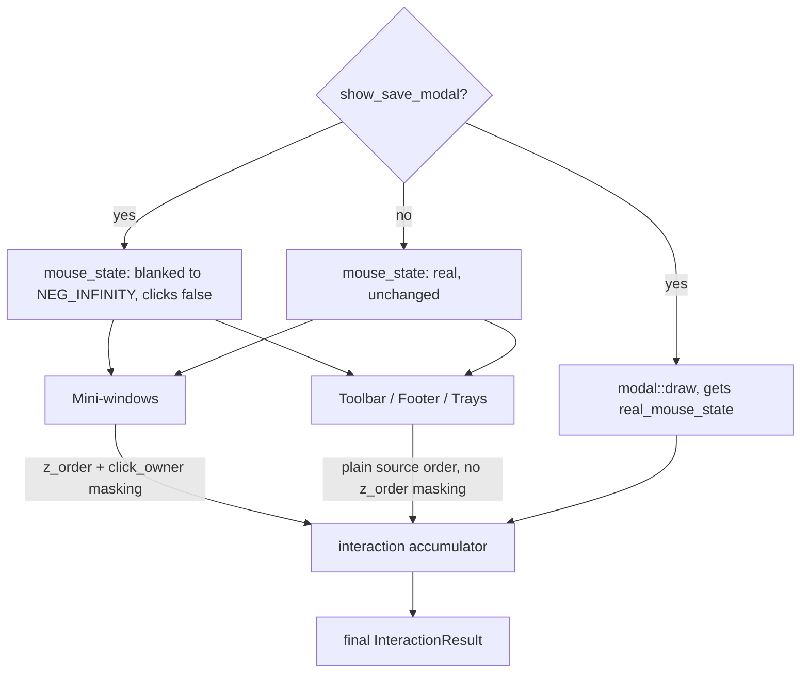

# Interaction
Users can interact with the desktop application using their mouse and keyboard in many ways. Each frame, OS and device events are processed by `winit`.
With the mouse, the Glacier app offers affordances and signifiers such as the mouse cursor icon and interactive color hovering.
Everything should be possible on the keyboard through hotkeys in the future.

## Input Priority

Certain components may 'take control' of the mouse state so it only applies to them — the save modal is the clearest example, blocking every other component's input for the frame.


## Click and Hover Ownership

A lot of UI components *will* overlap during the production of music. If a user has the piano roll active on their screen and they click a note, the Mixer behind the piano roll should not absorb the interaction.

### click_owner
```rust
// Determine which open window, if any, owns this frame's click 
let click_owner: Option<usize> = if mouse_state.left_clicked && !menu_is_hovered {
    self.z_order
        .iter()
        .rev()
        .find(|&&id| self.mini_windows[id].is_open && self.mini_windows[id].is_hovered(mouse_state.x, mouse_state.y))
        .copied()
} else {
    None
};
```
Computed once per frame after the bring-to-front pass. The topmost hovered open window owns the click.
### blocked (hover masking)
```rust
let blocked = self.context_menu.is_some() && menu_is_hovered
    || self.z_order
    .iter()
    .skip_while(|&&z_id| z_id != id)
    .skip(1)
    .any(|&above_id| {
        self.mini_windows[above_id].is_open
            && self.mini_windows[above_id].is_hovered(mouse_state.x, mouse_state.y)
    });
```
z_order is back-to-front — iterating forward from id gives windows drawn on top of it. If any open window above covers the mouse, this window is blocked.
### masked_mouse
```rust
let masked_mouse = MouseState {
    left_clicked: mouse_state.left_clicked && click_owner == Some(id),
    x: if !blocked { mouse_state.x } else { f32::NEG_INFINITY },
    y: if !blocked { mouse_state.y } else { f32::NEG_INFINITY },
    ..*mouse_state
};
```
Every window draw call receives &masked_mouse. MouseState must derive Copy for struct update syntax.

Note: only the mini-window loop computes `click_owner`/`blocked` z_order masking. Outside that loop, five different components handle masking differently:
- **Toolbar, footer, context menu, track tray, file tree** — use the shadowed `mouse_state`, which is real unless the save modal is open, in which case it's fully blanked (`x`/`y` to `NEG_INFINITY`, click flags to `false`) before any of these run.
- **`pattern_tray`** — masked only against the context menu, via `mouse_state.hidden(self.context_menu.is_some() && menu_is_hovered)`.
- **`modal`** — always receives `real_mouse_state`, fully unmasked, even while `show_save_modal` is true — otherwise the modal couldn't register clicks on its own buttons while everything else is blind to input.

These five components merge their `InteractionResult` in plain source order against the running `interaction` accumulator — no z_order priority between them.
